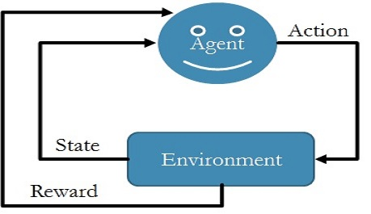
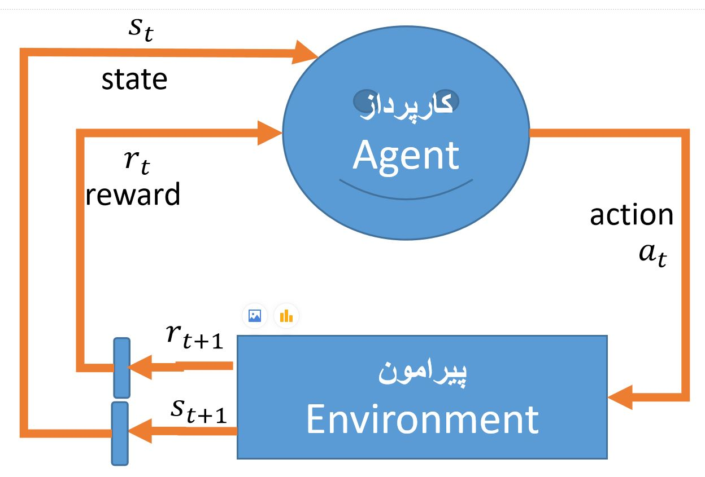

# Reinforcement Learning (RL)
(under construction)
1) **Introduction:** <a href="./RL-introduction.ipynb">Reinforcement Learning: Introduction</a>
<figure>

<figcaption>Reinforcement Learning: Essential elements.</figcaption>
</figure>

2) **Markov Decision Process:** A Markov decision process (MDP) is a mathematical framework used for modeling decision-making. We have an *agent* (e.g., the robot) that interacts with an *environment* by taking actions, transitioning between states, and receiving rewards. Here, we review the concepts and formulae of MDPs and remind the **Markov property** of them. Finally, we give an example in Python for a simple grid world.
<figure>

<figcaption>The agent at state s_t takes action a_t. Then, the environment goes to state s_t+1 and gives reward r_t+1.</figcaption>
</figure>